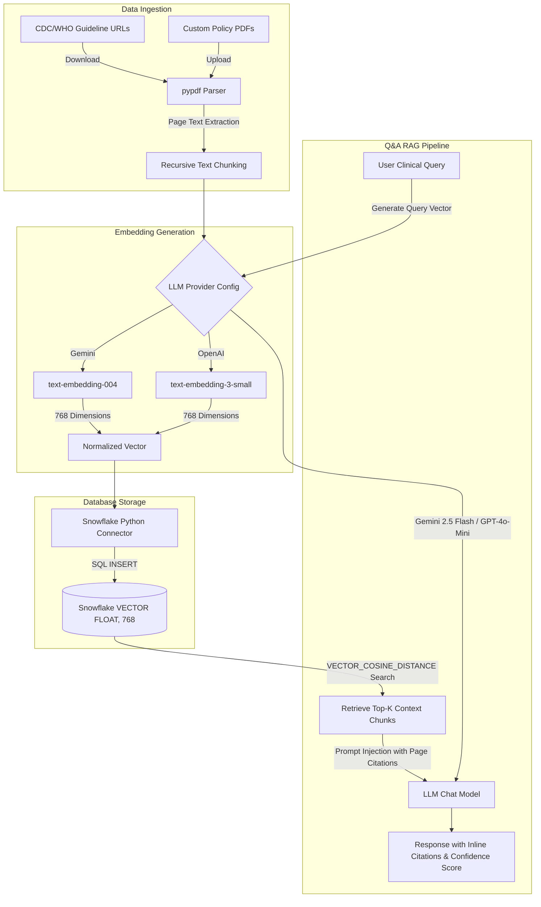

# Clinical Guideline RAG Assistant

A Retrieval-Augmented Generation (RAG) assistant designed for hospital policies and evidence-based medicine. It retrieves and summarizes clinical recommendations, provides inline citations, calculates retrieval confidence scores, and compares guidelines side-by-side.

This application is powered by **Snowflake Vector Search** for database storage and retrieval, with support for both **Google Gemini** and **OpenAI** LLM models for generating embeddings and completions.

---

## System Architecture

The diagram below outlines the document ingestion pipeline and the Q&A RAG flow:



---

## Key Features

- 📑 **Multi-Document Ingestion**: Automatically downloads and indexes public guidelines (CDC Opioid Prescribing Guideline 2022 and WHO Hypertension Treatment Guideline 2021) or lets you upload custom hospital policy PDFs.
- ❄️ **Native Snowflake Vector Search**: Creates schemas and handles vector retrieval using Snowflake's native `VECTOR(FLOAT, 768)` data type and `VECTOR_COSINE_SIMILARITY` function.
- 🧠 **Dual LLM Provider Support**: Connect via either Google Gemini API or OpenAI API. Automatically normalizes OpenAI embedding dimensions to 768 to maintain database consistency.
- 💬 **Evidence-Based Q&A**: Generates clinical answers strictly bounded by the retrieved context, complete with inline citations mapping directly to source page numbers.
- 📊 **Guideline Comparison**: Analyzes differences and alignments between distinct guidelines on specific clinical questions, formatting findings in a comparative table.
- 🛡️ **Confidence Scoring**: Evaluates and displays a confidence percentage and status (High/Medium/Low) based on semantic chunk similarity.
- 🔒 **Open Source Ready**: Completely secure layout with no hardcoded credentials, making it safe to publish on GitHub.

---

## Technology Stack

- **Frontend UI**: [Streamlit](https://streamlit.io/)
- **Vector Database**: [Snowflake](https://www.snowflake.com/) (using native SQL Vector Support)
- **AI Models & Embeddings**:
  - **Google Gemini**: `gemini-2.5-flash` (Completion) & `text-embedding-004` (768-dimensional Embeddings) via `google-genai`
  - **OpenAI**: `gpt-4o-mini` (Completion) & `text-embedding-3-small` (configured to output 768-dimensional Embeddings) via `openai`
- **Document Parser**: [pypdf](https://github.com/py-pdf/pypdf)

---

## Codebase Structure

```txt
clinical-guideline-rag/
├── .env.template          # Template for local configurations and secrets
├── .gitignore             # Git ignore file for secrets, caches, and envs
├── app.py                 # Landing page (entry point)
├── pages/
│   └── Clinical_App.py    # Main application (sidebar, tabs, RAG)
├── app_bootstrap.py       # Shared session config and helpers
├── ui_styles.py           # Shared CSS theme
├── config.py              # Configuration manager and LLM client interfaces
├── ingestion.py           # Ingestion pipeline (downloading, parsing, chunking)
├── rag_pipeline.py        # Core RAG logic, Q&A agent, and comparative analysis
├── requirements.txt       # Project python dependencies
├── vector_store.py        # Database layer (Snowflake native SQL and Vector connector)
└── tests/                 # Unit and integration test suite
    ├── test_llm.py        # Test suite for Gemini and OpenAI provider integrations
    ├── test_pdf.py        # Test suite for PDF parsing and chunking
    └── test_vector_store.py  # Test suite for Snowflake SQL query validations
```

---

## Getting Started

### 1. Prerequisites

- **Python 3.10 to 3.13** installed.
- A **Snowflake Account** (which supports native vector types).
- A **Google Gemini API Key** or an **OpenAI API Key**.

### 2. Installation

Clone this repository and navigate to the project directory:

```bash
git clone https://github.com/your-username/clinical-guideline-rag.git
cd clinical-guideline-rag
```

Create a virtual environment and install the required dependencies:

```bash
# Create virtual environment
python3 -m venv venv
source venv/bin/activate

# Install dependencies
pip install -r requirements.txt
```

### 3. Environment Configuration

Create a `.env` file in the root directory:

```bash
cp .env.template .env
```

Open the `.env` file and replace the placeholder values with your credentials:

```env
# Selected provider: 'gemini' or 'openai'
LLM_PROVIDER=gemini

# LLM API Keys (fill in whichever you choose to use)
GEMINI_API_KEY=your_gemini_api_key_here
OPENAI_API_KEY=your_openai_api_key_here

# Snowflake Connection Configuration
SNOWFLAKE_ACCOUNT=your_account_id.region
SNOWFLAKE_USER=your_username
SNOWFLAKE_PASSWORD=your_password
SNOWFLAKE_DATABASE=CLINICAL_DB
SNOWFLAKE_SCHEMA=PUBLIC
SNOWFLAKE_WAREHOUSE=COMPUTE_WH
```

*(Note: The `.env` file is listed in `.gitignore` to prevent committing sensitive keys to public repositories.)*

---

## Snowflake Database Setup

The application automatically creates the database schema and vector chunks table if they do not exist. However, you can run the following SQL queries inside your Snowflake worksheets console to pre-provision the environment:

```sql
-- 1. Create database and schema
CREATE DATABASE IF NOT EXISTS CLINICAL_DB;
CREATE SCHEMA IF NOT EXISTS CLINICAL_DB.PUBLIC;
USE SCHEMA CLINICAL_DB.PUBLIC;

-- 2. Create target table with vector data type
CREATE TABLE IF NOT EXISTS CLINICAL_GUIDELINE_CHUNKS (
    ID VARCHAR(36) PRIMARY KEY,
    DOCUMENT_NAME VARCHAR(255),
    PAGE_NUMBER INT,
    CHUNK_TEXT STRING,
    EMBEDDING VECTOR(FLOAT, 768) -- Store 768-dimensional floats
);
```

---

## Running the Application

Launch the Streamlit app:

```bash
streamlit run app.py
```

### Ingestion Flow:
1. Open the application in your browser (usually `http://localhost:8501`).
2. Verify system configurations in the sidebar. You can click **Test Connection** to check if your Snowflake credentials work.
3. Click **Init Schema** to verify the Snowflake table setup.
4. Navigate to the **Guidelines Repository** tab.
5. Click **Start Ingestion for Defaults**. This will download the CDC Opioids (2022) and WHO Hypertension (2021) guidelines, chunk them page-by-page, generate embeddings, and upload them to Snowflake.
6. Once complete, go back to the **Clinical Query & Q&A** or **Comparative Analysis** tabs and begin searching!

---

## Running the Test Suite

We have included unit and integration tests to verify all system components.

To run the test suite, ensure your virtual environment is active and run:

```bash
PYTHONPATH=. pytest tests/
```

Individual test files:
- `tests/test_pdf.py`: Tests document text extraction and boundaries.
- `tests/test_llm.py`: Tests API connectivity, embedding normalization, and completion.
- `tests/test_vector_store.py`: Tests Snowflake DDL and SQL query structures.
